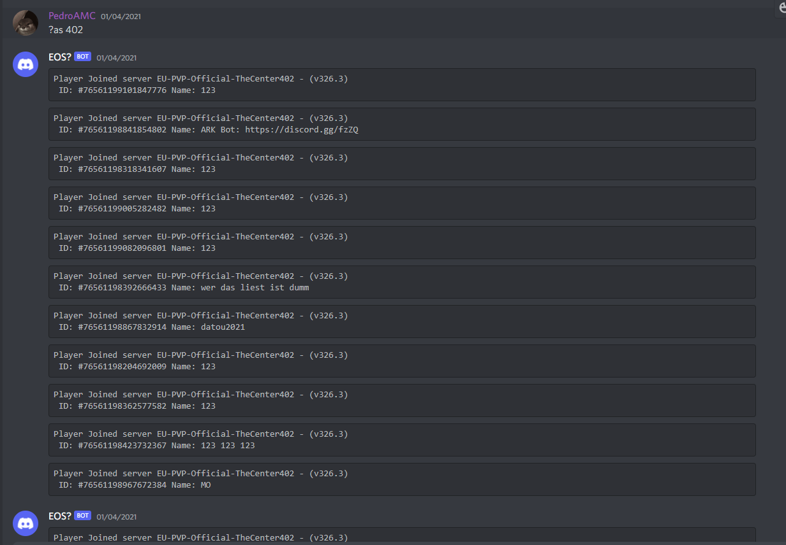
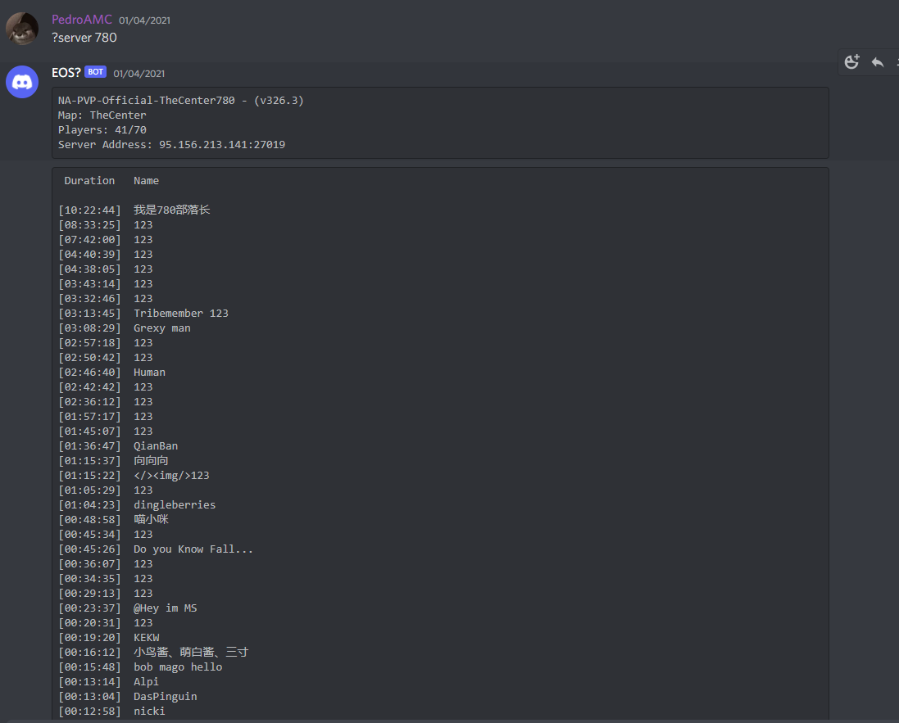
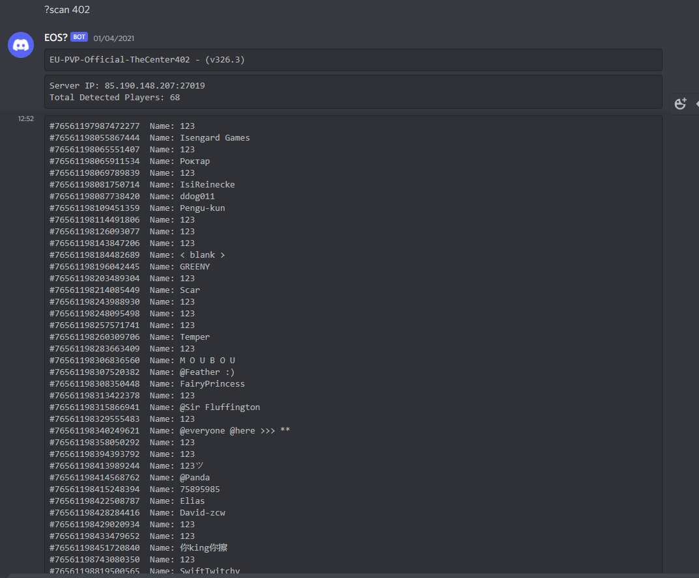
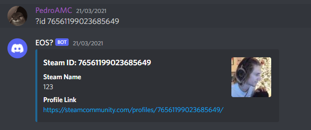

### UPDATE DISCLAIMER This is really old code that I programmed when I was learning. It has a bunch of spaghetti code, I know

# eos-bot
### Discord bot developed in C# for the game ARK Survival Evolved, capable of showing and tracking the players in every official pvp server.

## Feature 1 - track a server to show every player that joins and their respective steam ID.

## Feature 2 - show every player currently logged in to a certain server with 100% accuracy and also their session duration.

## Feature 3 - show every player currently logged in to a certain server and also their steam id. (not as accurate as feature 2)

## Feature 4 - show the steam profile corresponding to a certain steam id.

